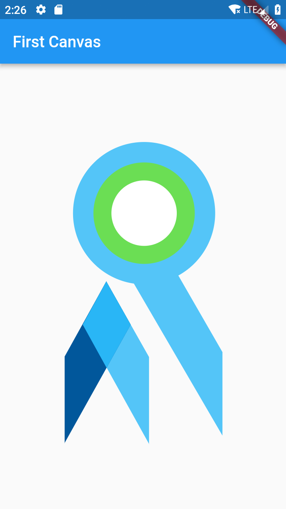
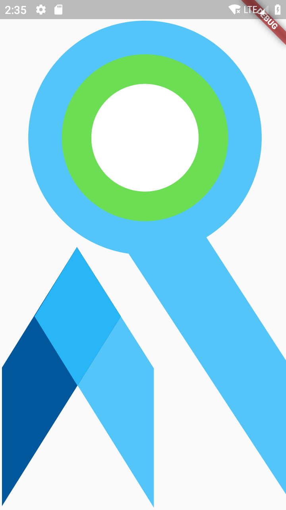

### :heart: Star :heart: the repo to support the project or :smile:[Follow Me](https://github.com/nb312).Thanks!
Facebook Page | Facebook Group | Developer 
--- | --- | ---
[Flutter Open ](https://www.facebook.com/flutteropen) | [Flutter Open](https://www.facebook.com/groups/948618338674126/) | [nb312](https://github.com/nb312)

# Canvas tutorial 01 | How to use the canvas in the flutter?
## 0. What we will create?

Today, I will tell you how to use the canvas to draw our own shape，this is step by step tutorial, let's go! First, Let me show you what we will create!   
  
Logo of Flutter Open

Yes, you are right, we will create this logo of Flutter Open.

## 1. Coordinate or Size of picture 
Before we start work, we should know the design pix of the logo, such as how about the circle size, or position of the rectangle and so on, so we should know, the below picture will should you the coordinate or size of the or shape, you should notice that the zero point is left_top in the screen and the picture is 584*648 pixel.  
   
The notes of circles with center coordinate and radius.   
    
the rotate upward flutter logo with point coordinate   

If you want to draw some shape by yourself, you should do this by yourself with PS or other picture modify tools. Also, do not forget the colors.
```
const BLUE_NORMAL = Color(0xff54c5f8);
const GREEN_NORMAL = Color(0xff6bde54);
const BLUE_DARK2 = Color(0xff01579b);
const BLUE_DARK1 = Color(0xff29b6f6);
```
## 2. Design Size VS Device Logical Size

When we design the shape, we just use the pixel we like, but there are so many devices with different screen size and the logic size is also different, sometimes we just put our customized shape in the container, so we can draw the size as much as the parent widget. For example, the size of this logo is 548*648 as the design, but the logical size to show this logo is 200*400, then it would show as below:
What we can we do with this, let's see the code below  
   

First, we should define a util class
```
import 'package:flutter/material.dart';
import 'dart:math';
class SizeUtil {
  static const _DESIGN_WIDTH = 580;
  static const _DESIGN_HEIGHT = 648;

  //logic size in device
  static Size _logicSize;

  //device pixel radio.

  static get width {
    return _logicSize.width;
  }

  static get height {
    return _logicSize.height;
  }

  static set size(size) {
    _logicSize = size;
  }

  //@param w is the design w;
  static double getAxisX(double w) {
    return (w * width) / _DESIGN_WIDTH;
  }

// the y direction
  static double getAxisY(double h) {
    return (h * height) / _DESIGN_HEIGHT;
  }

  // diagonal direction value with design size s.
  static double getAxisBoth(double s) {
    return s *
        sqrt((width * width + height * height) /
            (_DESIGN_WIDTH * _DESIGN_WIDTH + _DESIGN_HEIGHT * _DESIGN_HEIGHT));
  }
}
``` 

This will let you change the design size to your logic size. The second just use it.you can init the size with device size, that means you draw the shape as much as the screen if you do not assign another size. 
```
SizeUtil.size = MediaQuery.of(context).size;
```

## 3. Define CustomPainter  
This is the most import class to define our own shape, all of the logical to draw shape is writed here.
First, create a class extends CustomPainter and create a paint. If the size is not small than 1.0 then, assign it as the logical size.
```
class OpenPainter extends CustomPainter {
@override
void paint(Canvas canvas, Size size) {
if (size.width > 1.0 && size.height > 1.0) {
  print(">1.9");
  SizeUtil.size = size;
}
var paint = Paint()
  ..style = PaintingStyle.fill
  ..color = BLUE_NORMAL
  ..isAntiAlias = true;
}
 @override
  bool shouldRepaint(CustomPainter oldDelegate) => false;
}
``` 
Then, draw the Flutter logo. But first, we should use the 'canvas.drawPath' to draw a quadrilateral.
```
void _drawFourShape(Canvas canvas,
    {Offset left_top,
    Offset right_top,
    Offset right_bottom,
    Offset left_bottom,
    Size size,
    paint}) {
  left_top = _convertLogicSize(left_top, size);
  right_top = _convertLogicSize(right_top, size);
  right_bottom = _convertLogicSize(right_bottom, size);
  left_bottom = _convertLogicSize(left_bottom, size);
  var path1 = Path()
    ..moveTo(left_top.dx, left_top.dy)
    ..lineTo(right_top.dx, right_top.dy)
    ..lineTo(right_bottom.dx, right_bottom.dy)
    ..lineTo(left_bottom.dx, left_bottom.dy);
  canvas.drawPath(path1, paint);
}
Offset _convertLogicSize(Offset off, Size size) {
  return Offset(SizeUtil.getAxisX(off.dx), SizeUtil.getAxisY(off.dy));
}
``` 
Last, we will draw the circles in the function of 'paint(canvas, size)'.
```
var circleCenter = Offset(SizeUtil.getAxisX(294), SizeUtil.getAxisY(175));
paint.color = BLUE_NORMAL;
canvas.drawCircle(circleCenter, SizeUtil.getAxisBoth(174), paint);
paint.color = GREEN_NORMAL;
canvas.drawCircle(circleCenter, SizeUtil.getAxisBoth(124), paint);
paint.color = Colors.white;
canvas.drawCircle(circleCenter, SizeUtil.getAxisBoth(80), paint);
```
Finally, we should save the canvas.
```
canvas.save();
canvas.restore();
```
4. Use the OpenPainter
We define the OpenPainter now, so how can we use the OpenPainter.The most import class is CustomPaint. you should use it as a parent widget.
```
CustomPaint(
  painter: OpenPainter(),
)
```
Then we can use the CustomPaint as a common widget to show our shape. In our home page, we can use this like this.
```
Scaffold(
  appBar: AppBar(
    title: Text("First Canvas"),
  ),
  body: Container(
      child: Center(
    child: Container(
      width: 280,
      height: 320.0,
      child: CustomPaint(
        painter: OpenPainter(),
      ),
    ),
  )),
)
```
It will show like this.    
     
with logical size of width: 280,height: 320.0

If we change the size of the container as we say above 200*400 for a logic size，it will be a bit different.
```
Container(
//          width: 280,
//          height: 320.0,
          width: 200,
          height: 400,
          child: CustomPaint(
            painter: OpenPainter(),
          ),
        )
```
   
with logical size of width: 200,height: 400.0

If we do not set the size, the size in the 'paint(canvas, size)' function will be zero, we will fit the device size, let's check whether it right or not, this time we should cancel the parent widget of Center, then we can visit it.
```
Scaffold(
//      appBar: AppBar(
//        title: Text("First Canvas"),
//      ),
      body: Container(
        child: Container(
//          width: 280,
//          height: 320.0,
          child: CustomPaint(
            painter: OpenPainter(),
          ),
        ),
      ),
    );
``` 
   
with the logical size of the device size  

That's nice, we have complete the logo of Flutter Open. This is created by Flutter Open source community. Tanks for your support.
The whole project is here: https://github.com/FlutterOpen/flutter-canvas. If you like or a bit help to you, please give me a star.

Facebook page: https://www.facebook.com/flutteropen  
Facebook group: https://www.facebook.com/groups/948618338674126/  
