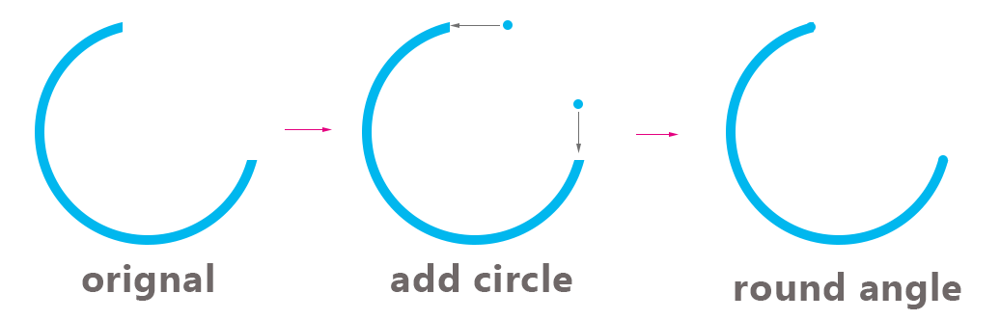
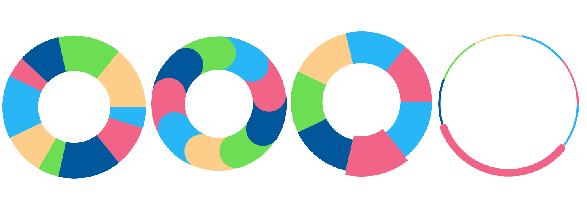
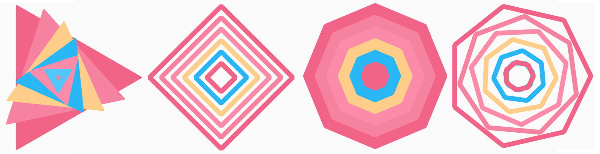
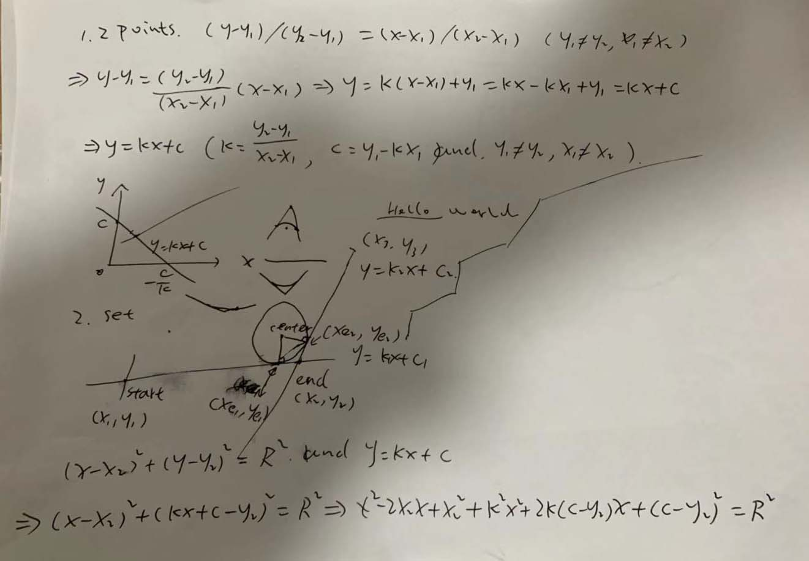
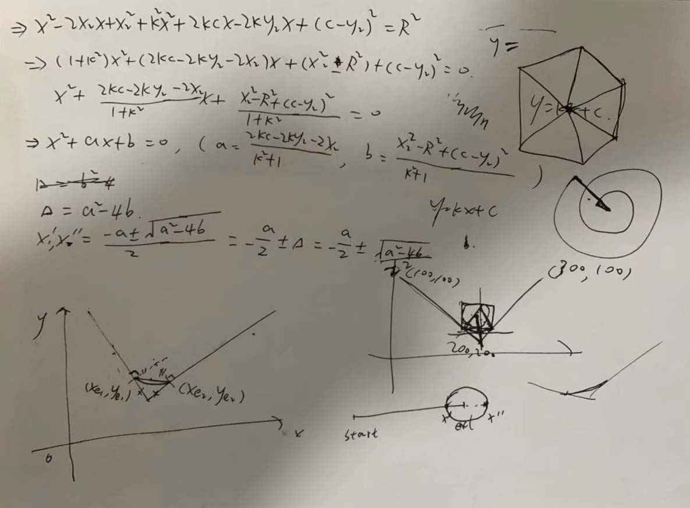
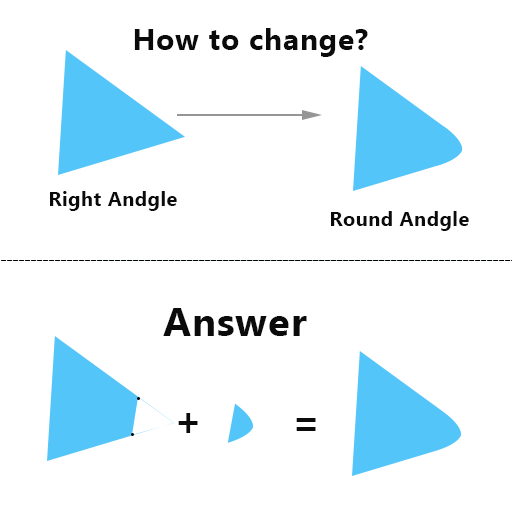
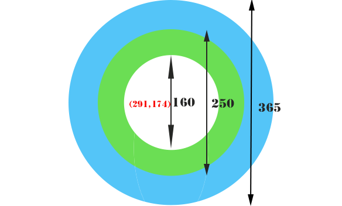
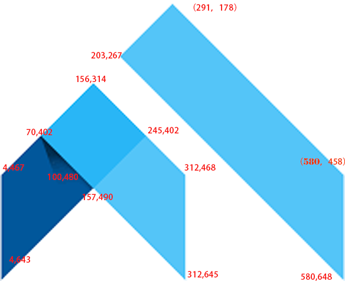
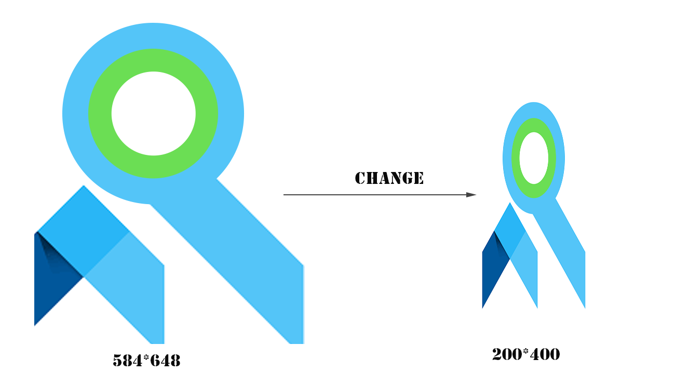

### :heart: Star :heart: the repo to support the project or :smile:[Follow Me](https://github.com/nb312).Thanks!
Facebook Page | Facebook Group | Developer
--- | --- | ---
[Flutter Open ](https://www.facebook.com/flutteropen) | [Flutter Open](https://www.facebook.com/groups/948618338674126/) | [NieBin](https://github.com/nb312)

Article | Pictures   
 --- | --- 

[Canvas tutorial 04 How to draw a pie chart and with a round angle in the flutter?](https://medium.com/flutteropen/canvas-tutorial-04-how-to-draw-a-pie-chart-and-with-a-round-angle-in-the-flutter-8a22126704f4) |   
[Canvas tutorial 03 How to draw a regular round angle polygon in the flutter?](https://medium.com/flutteropen/canvas-tutorial-03-how-to-draw-a-regular-round-angle-polygon-83b055b7af6c) | 
[tutorial 02 How to draw round angle polygon in the flutter?](https://medium.com/flutteropen/canvas-tutorial-02-how-to-draw-round-angle-polygon-in-the-flutter-7890e933cfb1)  |       
[ tutorial 01 How to use the canvas in the flutter?](https://medium.com/flutteropen/canvas-tutorial-01-how-to-use-the-canvas-in-the-flutter-8aade29ddc9)  |       
