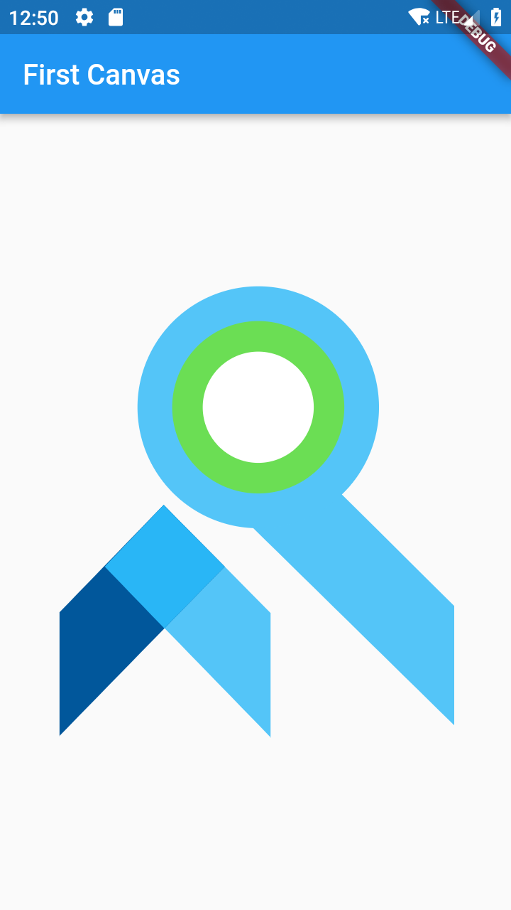
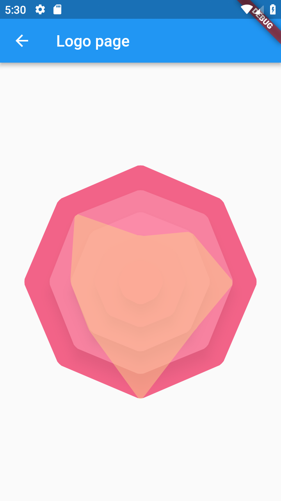

### :heart: Star :heart: the repo to support the project or :smile:[Follow Me](https://github.com/nb312).Thanks!
Facebook Page | Facebook Group | Developer
--- | --- | ---
[Flutter Open ](https://www.facebook.com/flutteropen) | [Flutter Open](https://www.facebook.com/groups/948618338674126/) | [NieBin](https://github.com/nb312)

Article | Pictures   
 --- | --- 
 | [ tutorial 01 How to use the canvas in the flutter?](https://medium.com/flutteropen/canvas-tutorial-01-how-to-use-the-canvas-in-the-flutter-8aade29ddc9)   

 [tutorial 02 How to draw round angle polygon in the flutter?](https://medium.com/flutteropen/canvas-tutorial-02-how-to-draw-round-angle-polygon-in-the-flutter-7890e933cfb1) |      
