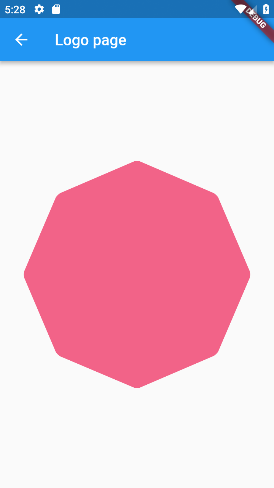

### :heart: Star :heart: the repo to support the project or :smile:[Follow Me](https://github.com/nb312).Thanks!
# Canvas tutorial 02 | How to draw round angle polygon in the flutter?
Whole project |Facebook group |  Facebook page | Developer
--- | --- | --- | ---
[flutter-canvas](https://github.com/FlutterOpen/flutter-canvas) | [FlutterOpen-Group](https://www.facebook.com/groups/948618338674126/?source_id=2005989649497620) | [Flutter Open](https://www.facebook.com/flutteropen) | [NieBin](https://github.com/nb312)

Creat by [Flutter Open](https://www.facebook.com/flutteropen).


In the flutter, only the common polygon was provided to direct to use. In this tutorial, you will learn how to use the common Path class to draw it.
If you do not use a canvas before, you should read this Canvas tutorial 01. There is some basic knowledge for you to learn.

## 0. What we will draw?


our purpose

You can see it, there are many round angles polygon, they just cover the bottom one to show. So let's begin our travel.

## 1. How change right angle to round angle?
When you ask the question, you have grasped the most important key point. Of course, we have the method to solve this problem. Let's see the picture below.

   

change the right angle to round angleIt is easy to understand, you just need to find two points in two sides of the triangle, between them add an arc for it. If we implement this, other work will be easy.

## 2. Certain two points in the triangle.
This work will need some math knowledge, look follow the pictures, I use some math to certain the point. If you do not understand, it doesn't meter, you can jump to the code part.  
  
step 1  
   
step 2   

In this code, we can give two points with function `intersectionPoint`, then we can certainly one line, if we give the distance we want to cut one part from the line, then we can certain the cut point, this point is that we want in the triangle, the same as this method, we can get the another point. But If you do not know the code, just watch how to use it.

```dart
import "dart:math";
import 'package:flutter/material.dart';

class Line {
  ///y = kx + c
  static double normalLine(x, {k = 0, c = 0}) {
    return k * x + c;
  }

  ///Calculate the param K in y = kx +c
  static double paramK(Point p1, Point p2) {
    if (p1.x == p2.x) return 0;
    return (p2.y - p1.y) / (p2.x - p1.x);
  }

  ///Calculate the param C in y = kx +c
  static double paramC(Point p1, Point p2) {
    return p1.y - paramK(p1, p2) * p1.x;
  }
}

/// start point p1, end point p2,p2 is center of the circle,r is its radius.
class LineInterCircle {
  /// start point p1, end point p2,p2 is center of the circle,r is its radius.
  /// param a: y = kx +c intersect with circle,which has the center with point2 and radius R .
  /// when derive to x2+ ax +b = 0 equation. the param a is here.
  static double paramA(Point p1, Point p2) {
    return (2 * Line.paramK(p1, p2) * Line.paramC(p1, p2) -
            2 * Line.paramK(p1, p2) * p2.y -
            2 * p2.x) /
        (Line.paramK(p1, p2) * Line.paramK(p1, p2) + 1);
  }

  /// start point p1, end point p2,p2 is center of the circle,r is its radius.
  /// param b: y = kx +c intersect with circle,which has the center with point2 and radius R .
  /// when derive to x2+ ax +b = 0 equation. the param b is here.
  static double paramB(Point p1, Point p2, double r) {
    return (p2.x * p2.x -
            r * r +
            (Line.paramC(p1, p2) - p2.y) * (Line.paramC(p1, p2) - p2.y)) /
        (Line.paramK(p1, p2) * Line.paramK(p1, p2) + 1);
  }

  ///the circle has the intersection or not
  static bool isIntersection(Point p1, Point p2, double r) {
    var delta = sqrt(paramA(p1, p2) * paramA(p1, p2) - 4 * paramB(p1, p2, r));
    return delta >= 0.0;
  }

  ///the x coordinate whether or not is between two point we give.
  static bool _betweenPoint(x, Point p1, Point p2) {
    if (p1.x > p2.x) {
      return x > p2.x && x < p1.x;
    } else {
      return x > p1.x && x < p2.x;
    }
  }

  static Point _equalX(Point p1, Point p2, double r) {
    if (p1.y > p2.y) {
      return Point(p2.x, p2.y + r);
    } else if (p1.y < p2.y) {
      return Point(p2.x, p2.y - r);
    } else {
      return p2;
    }
  }

  static Point _equalY(Point p1, Point p2, double r) {
    if (p1.x > p2.x) {
      return Point(p2.x + r, p2.y);
    } else if (p1.x < p2.x) {
      return Point(p2.x - r, p2.y);
    } else {
      return p2;
    }
  }

  ///intersection point
  static Point intersectionPoint(Point p1, Point p2, double r) {
    if (p1.x == p2.x) return _equalX(p1, p2, r);
    if (p1.y == p2.y) return _equalY(p1, p2, r);
    var delta = sqrt(paramA(p1, p2) * paramA(p1, p2) - 4 * paramB(p1, p2, r));
    if (delta < 0.0) {
      //when no intersection, i will return the center of the circ  le.
      return p2;
    }
    var a_2 = -paramA(p1, p2) / 2.0;
    var x1 = a_2 + delta / 2;
    if (_betweenPoint(x1, p1, p2)) {
      var y1 = Line.paramK(p1, p2) * x1 + Line.paramC(p1, p2);
      return Point(x1, y1);
    }
    var x2 = a_2 - delta / 2;
    var y2 = Line.paramK(p1, p2) * x2 + Line.paramC(p1, p2);
    return Point(x2, y2);
  }
}
```

## 3. Draw the round angle
Fist we need to extends the CustomPainter, the same as Canvas tutorial 01. If you don't know how to use, you should watch it before continuing. In our `void paint(Canvas canvas, Size size)` function we will draw our shape.
When giving three points, and intersect in the point2, we can draw the two and the round angle, we use aPath to draw it, code like this:
```dart
var interP1 = LineInterCircle.intersectionPoint(p1, p2, distance);
var interP2 = LineInterCircle.intersectionPoint(p3, p2, distance);
path.lineTo(interP1.x, interP1.y);
path.arcToPoint(
  Offset(interP2.x, interP2.y),
  radius: Radius.circular(distance * 6),
);
```
That means, we use three points to certain one angle, we can sign as {p1,p2,p3}.

## 4. Draw round angle polygon.
Above code, If we have three sides polygon, we will draw {p1,p2,p3},{p2,p3,p1},{p3,p1,p2}; if we put in a list, there should be like this [p1,p2,p3,p1,p2] ,that means we should add [p1,p2] to the end. so the code of draw round angle polygon will be like this:

```dart
Path _drawRoundPolygon(List<Point> ps, double distance, Canvas canvas, paint) {
  var path = Path();
  ps.add(ps[0]);
  ps.add(ps[1]);
  var p0 = LineInterCircle.intersectionPoint(ps[1], ps[0], distance);
  path.moveTo(p0.x, p0.y);
  for (int i = 0; i < ps.length - 2; i++) {
    var p1 = ps[i];
    var p2 = ps[i + 1];
    var p3 = ps[i + 2];
    var interP1 = LineInterCircle.intersectionPoint(p1, p2, distance);
    var interP2 = LineInterCircle.intersectionPoint(p3, p2, distance);
    path.lineTo(interP1.x, interP1.y);
    path.arcToPoint(
      Offset(interP2.x, interP2.y),
      radius: Radius.circular(distance * 6),
    );
  }
  return path;
}
```

## 5. Use the function `_drawRoundPolygon`
You can use it now to draw your own round polygon but will handle its size to fit the parent, It doesn't affect the main logic.
```dart
@override
void paint(Canvas canvas, Size size) {

  if (size.width > 1.0 && size.height > 1.0) {
    print(">1.9");
    _sizeUtil.logicSize = size;
  }
}
void _drawWithPoint(canvas, paint, list, {hasShadow = false}) {
  list = _resizePoint(list);
  var path = _drawRoundPolygon(list, 4.0, canvas, paint);
  if (hasShadow) {
    canvas.drawShadow(path, Colors.black26, 10.0, true);
  }
  canvas.drawPath(path, paint);
}

List<Point> _resizePoint(List<Point> list) {
  List<Point> l = List<Point>();
  for (var p in list) {
    l.add(Point(_sizeUtil.getAxisX(p.x), _sizeUtil.getAxisY(p.y)));
  }
  return l;
}
```

Draw the large polygon in the bottom
```dart
var paint = Paint()
  ..style = PaintingStyle.fill
  ..color = BLUE_NORMAL
  ..isAntiAlias = true;
List<Point> list1 = [
  Point(250.0, 0.0),
  Point(425.0, 75.0),
  Point(500.0, 250.0),
  Point(425.0, 425.0),
  Point(250.0, 500.0),
  Point(75.0, 426.0),
  Point(0.0, 250.0),
  Point(75.0, 75.0),
];
paint.color = RED_DARK1;
_drawWithPoint(canvas, paint, list1);
```
  
the large one

With others
```dart
@override
void paint(Canvas canvas, Size size) {

  if (size.width > 1.0 && size.height > 1.0) {
    print(">1.9");
    _sizeUtil.logicSize = size;
  }
  var paint = Paint()
    ..style = PaintingStyle.fill
    ..color = BLUE_NORMAL
    ..isAntiAlias = true;
  List<Point> list1 = [
    Point(250.0, 0.0),
    Point(425.0, 75.0),
    Point(500.0, 250.0),
    Point(425.0, 425.0),
    Point(250.0, 500.0),
    Point(75.0, 426.0),
    Point(0.0, 250.0),
    Point(75.0, 75.0),
  ];
  paint.color = RED_DARK1;
  _drawWithPoint(canvas, paint, list1);
  List<Point> list2 = [
    Point(250.0, 53.0),
    Point(392.0, 108.0),
    Point(449.0, 250.0),
    Point(392.0, 390.0),
    Point(250.0, 448.0),
    Point(110.0, 390.0),
    Point(54.0, 250.0),
    Point(110.0, 108.0),
  ];
  paint.color = RED_DARK2;
  _drawWithPoint(canvas, paint, list2, hasShadow: true);

  List<Point> list3 = [
    Point(250.0, 100.0),
    Point(358.0, 143.0),
    Point(400.0, 250.0),
    Point(355.0, 355.0),
    Point(250.0, 400.0),
    Point(144.0, 357.0),
    Point(100.0, 250.0),
    Point(144.0, 144.0),
  ];
  paint.color = RED_DARK3;
  _drawWithPoint(canvas, paint, list3, hasShadow: true);

  List<Point> list4 = [
    Point(250.0, 150.0),
    Point(320.0, 180.0),
    Point(348.0, 250.0),
    Point(320.0, 320.0),
    Point(250.0, 348.0),
    Point(180.0, 320.0),
    Point(150.0, 250.0),
    Point(180.0, 180.0),
  ];
  paint.color = RED_DARK4;
  _drawWithPoint(canvas, paint, list4, hasShadow: true);

  List<Point> list5 = [
    Point(250.0, 202.0),
    Point(286.0, 217.0),
    Point(300.0, 250.0),
    Point(284.0, 284.0),
    Point(250.0, 300.0),
    Point(214.0, 282.0),
    Point(202.0, 250.0),
    Point(216.0, 216.0),
  ];
  paint.color = RED_DARK5;
  _drawWithPoint(canvas, paint, list5, hasShadow: true);

  List<Point> listYellow = [
    Point(110.0, 104.0),
    Point(250.0, 153.0),
    Point(358.0, 143.0),
    Point(450.0, 252.0),
    Point(369.0, 349.0),
    Point(250.0, 504.0),
    Point(140.0, 353.0),
    Point(100.0, 250.0),
  ];
  paint.color = YELLOW_NORMAL.withOpacity(0.5);
  _drawWithPoint(canvas, paint, listYellow);
  canvas.save();
  canvas.restore();
}
```


## Conclusion
In this article, we learn how to draw the round angle polygon.
1. Consider the comply method, how to change the right angle to round angle. If we want to draw the regular polygon, it will a bit different, I will try to comply with this situation in the future.
2. Certain the two points near the angle, this is very important with our way.
3. draw the round angle, with three points and a distance we certain the angle.
4. We use the points of a list to certain the round angle polygon
5. We handle the size between the logic size and design size, then we use it.
The whole project is here, thanks for a star: https://github.com/FlutterOpen/flutter-canvas
Creat by [Flutter Open](https://www.facebook.com/flutteropen).

---
